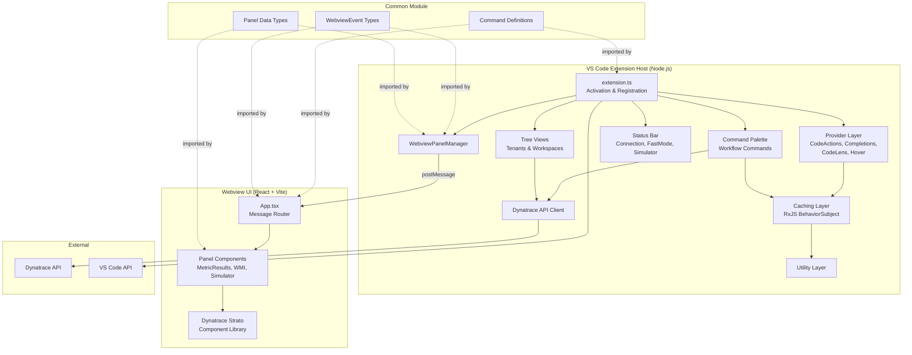
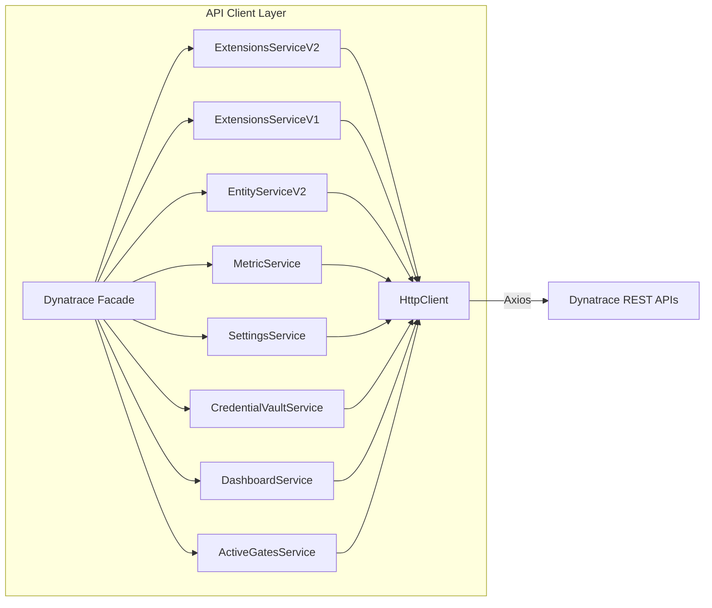
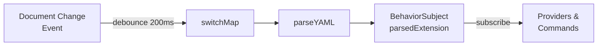
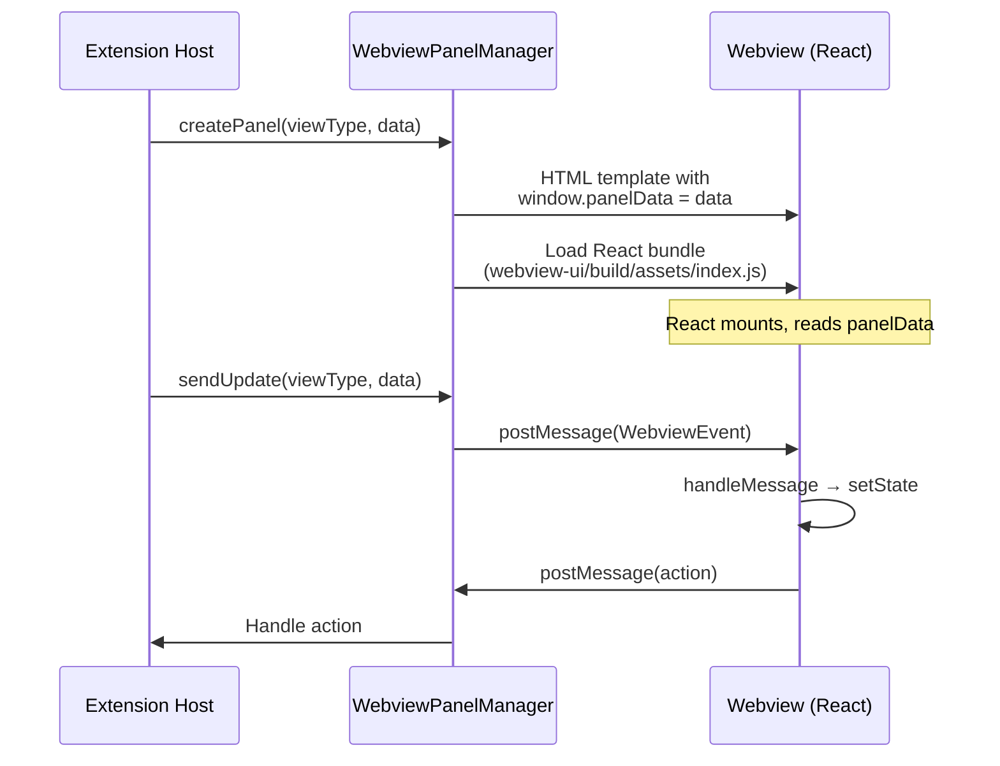

# Architecture

This document describes the internal architecture, code layers, design patterns, and key mechanisms of the Dynatrace Extensions VS Code extension. It is intended for developers contributing to or maintaining the project.

For environment setup, testing, branching, and contribution rules, see [CONTRIBUTING.md](CONTRIBUTING.md).

---

## Table of Contents

- [Overview](#overview)
- [High-Level Architecture](#high-level-architecture)
- [Extension Entry Point & Lifecycle](#extension-entry-point--lifecycle)
- [VS Code Provider Layer](#vs-code-provider-layer)
- [Command Palette Workflows](#command-palette-workflows)
- [Dynatrace API Client](#dynatrace-api-client)
- [Caching & Reactive Data](#caching--reactive-data)
- [Tree Views](#tree-views)
- [Status Bar](#status-bar)
- [Webview Panel System](#webview-panel-system)
- [Common Module](#common-module)
- [Utility Layer](#utility-layer)
- [Build & Bundling](#build--bundling)
- [Key Design Patterns](#key-design-patterns)

---

## Overview

This is a VS Code extension that provides a specialised toolkit for developing Dynatrace Extensions 2.0. It is structured as a **two-project monorepo**:

- **Extension Host** (`src/`) — a Node.js-based VS Code extension compiled with ESBuild
- **Webview UI** (`webview-ui/`) — a React application built with Vite, rendered inside VS Code webview panels
- **Common** (`common/`) — shared TypeScript types, command definitions, and event contracts used by both projects

---

## High-Level Architecture



---

## Extension Entry Point & Lifecycle

**File:** `src/extension.ts`

The `activate()` function is the VS Code-mandated entry point. It registers all features as disposables pushed to `context.subscriptions`.

### Activation sequence

1. Store the activation context globally (`setActivationContext()`)
2. Set VS Code context properties for conditional UI (`setContextProperty()`)
3. Initialize the data cache (`initializeCache()`)
4. Register features in groups:
   - **Command palette workflows** — ~18 major commands (build, upload, activate, etc.)
   - **Completion providers** — Topology, entity selectors, icons, Prometheus, screens, WMI, configuration
   - **Code action providers** — Snippets, SNMP, Prometheus, JMX, diagnostic fixes
   - **Code lens providers** — Simulator, JMX, Prometheus, selectors, screens, WMI, SNMP
   - **Tree views** — Workspaces and tenants/environments
   - **Diagnostics listeners** — Debounced (500ms) on document changes
   - **Webview panel serializers** — For restoring panels on VS Code reload
   - **Status bar items** — Connection, fast mode
5. Handle any pending workspace initialization from a previous session

### Deactivation

`deactivate()` cleans up simulator processes, logger channels, and temporary log files.

---

## VS Code Provider Layer

Providers implement VS Code API interfaces to deliver editor intelligence features. Each provider type lives in its own directory.

| Directory | VS Code Interface | Purpose |
|-----------|-------------------|---------|
| `src/codeActions/` | `CodeActionProvider` | Quick fixes, snippet generation, schema wizards |
| `src/codeCompletions/` | `CompletionItemProvider` | Context-aware auto-complete suggestions |
| `src/codeLens/` | `CodeLensProvider` | Inline actionable buttons above code |
| `src/hover/` | `HoverProvider` | Tooltip information on hover |

### Singleton pattern

All providers are instantiated as **lazy singletons** using `createSingletonProvider()` from `src/utils/singleton.ts`:

```typescript
// Definition
export const getMyProvider = createSingletonProvider(MyProvider);

// Usage during registration
vscode.languages.registerCodeLensProvider(selector, getMyProvider());
```

The factory caches the first instance and returns it on subsequent calls.

### Document selectors

Providers target specific files using selectors defined in `src/constants.ts`:

- `MANIFEST_DOC_SELECTOR` — targets `**/extension/extension.yaml`
- `ACTIVATION_SCHEMA_DOC_SELECTOR` — targets `**/extension/activationSchema.json`
- `TEMP_CONFIG_DOC_SELECTOR` — targets `**/tempConfigFile.jsonc`

### Diagnostic codes

A uniform catalog of diagnostic codes (DED001–DED021) is defined in `src/constants.ts`. These cover:
- Extension name validation (required, length, format, custom prefix)
- Metric key conventions (counter/gauge suffixes)
- Screen/card relationship validation
- OID validation (syntax, readability, type conflicts)
- Variable definition tracking

### Data flow in providers

Providers consume **cached data** rather than fetching on demand. The caching layer (see below) keeps parsed manifests, entity types, Barista icons, SNMP OIDs, and scrape results up to date. Providers call getter functions like `getCachedParsedExtension()` to access this data.

Some code lens providers maintain their own state (e.g., loading status, last scrape time) and emit change events via `_onDidChangeCodeLenses` to trigger a UI refresh.

---

## Command Palette Workflows

**Directory:** `src/commandPalette/`

Each command is implemented in its own file and exports an async workflow function and optionally a core implementation function.

### Pattern: Precondition → Core Logic

```typescript
export const buildExtensionWorkflow = async () => {
  if (
    (await checkWorkspaceOpen()) &&
    (await isExtensionsWorkspace()) &&
    (await checkCertificateExists("dev")) &&
    (await checkNoProblemsInManifest())
  ) {
    await buildExtension();
  }
};
```

- **Precondition checkers** are reusable functions in `src/utils/conditionCheckers.ts` (e.g., `checkTenantConnected()`, `checkDtSdkPresent()`, `checkCertificateExists()`)
- The workflow function is what gets registered with VS Code in `extension.ts`
- Core logic uses Dynatrace API client, file system operations, subprocess execution, and user interaction (quick picks, input boxes)

### Registration in extension.ts

Workflows are wrapped with logging and error handling before being pushed as command disposables:

```typescript
context.subscriptions.push(
  vscode.commands.registerCommand("dynatrace-extensions.buildExtension", buildExtensionWorkflow)
);
```

---

## Dynatrace API Client

**Directory:** `src/dynatrace-api/`

A layered HTTP client for interacting with Dynatrace environments.



### Layers

1. **`HttpClient`** (`http_client.ts`) — Axios-based HTTP transport
   - `makeRequest<T>()` — general-purpose request with authorization headers
   - `paginatedCall<T>()` — automatic multi-page iteration via `nextPageKey`
   - Error wrapping into `DynatraceAPIError`
   - Supports file uploads, response type overrides, and `AbortSignal` cancellation

2. **`Dynatrace`** (`dynatrace.ts`) — Facade class that composes all service instances
   - Constructor takes `baseUrl` and `apiToken`
   - A single `HttpClient` is shared across all services

3. **Service modules** (`environment_v2/`, `configuration_v1/`) — one file per API endpoint
   - Each service class receives the `HttpClient` and exposes typed methods
   - Examples: `ExtensionsServiceV2.upload()`, `EntityServiceV2.list()`, `MetricService.query()`

4. **Interface/DTO layer** (`interfaces/`) — TypeScript types for API request/response contracts
   - Domain-specific: `MinimalExtension`, `Entity`, `EntityType`, `SettingsObject`, `ActiveGate`, etc.
   - Transport: `DynatraceRequestConfig`, `PaginatedResponse<T>`, `DynatraceError`

### Error handling

`DynatraceAPIError` extends `Error` with structured fields (status code, constraint violations, error message) for downstream consumers to handle API failures with full context.

### Access pattern

Other parts of the codebase obtain an authenticated client via the tree view layer:

```typescript
const dtClient = await getDynatraceClient();
const entities = await dtClient.entitiesV2.list({ entitySelector: "..." });
```

---

## Caching & Reactive Data

**File:** `src/utils/caching.ts`

The caching layer provides module-level in-memory storage for frequently accessed data, reducing redundant parsing and API calls. It is the primary data source for providers.

### Manifest parsing pipeline

The extension manifest (`extension.yaml`) is parsed reactively using RxJS:



- A `BehaviorSubject<ExtensionStub>` holds the latest parsed manifest
- Document change/save/open events push new content into the pipeline
- `switchMap` with `delay(200)` debounces rapid edits
- Parse errors are swallowed — the last valid parse is retained

### Cache categories

| Cache | Type | Source |
|-------|------|--------|
| `parsedExtension` | `BehaviorSubject<ExtensionStub>` | YAML document changes |
| `builtinEntityTypes` | `EntityType[]` | Dynatrace API on init |
| `baristaIcons` | `string[]` | Barista icon CDN on init |
| `selectorStatuses` | `Map<string, ValidationStatus>` | Code lens validation |
| `prometheusData` | `PromData` | Prometheus scraper code lens |
| `jmxData` | `JMXData` | JMX wizard code lens |
| `wmiQueryResults` | `Map<string, WmiQueryResult>` | WMI code lens |
| `snmpOIDs` | `Map<string, OidInformation>` | MIB file parsing |
| `entityInstances` | `Map<string, Entity[]>` | API entity queries |
| `localSnmpDatabase` | `OidInformation[]` | MIB file loading |

### Initialization

`initializeCache()` is called during activation:
1. Resets all caches to default values
2. Creates the manifest processing pipeline with initial content
3. Sets up document change listeners
4. Waits for first successful parse (blocks activation until ready)
5. Fires background loads for entity types, Barista icons, and SNMP data

### API

All caches are accessed through exported getter/setter functions (e.g., `getCachedParsedExtension()`, `setCachedJMXData()`). This encapsulates storage and allows for future refactoring without impacting consumers.

---

## Tree Views

**Directory:** `src/treeViews/`

Two tree views appear in the VS Code sidebar, each backed by a `TreeDataProvider`.

### Tenants/Environments Tree

**File:** `src/treeViews/tenantsTreeView.ts`

- **Hierarchy:** Environment → Extensions → Monitoring Configurations
- **Data source:** Stored environment credentials + Dynatrace API
- Each environment node wraps a `Dynatrace` client instance
- Status indicators: monitoring config status shown as emoji (🟢 OK, 🔴 ERROR, ⚫ UNKNOWN)
- **Key exports:**
  - `getDynatraceClient(tenant?)` — get the API client for the current or specified environment
  - `getConnectedTenant()` — get the currently selected environment
  - `refreshTenantsTreeView()` — trigger UI refresh via `EventEmitter`

### Workspaces Tree

**File:** `src/treeViews/workspacesTreeView.ts`

- **Hierarchy:** Workspace → Extensions
- **Data source:** Filesystem only (discovers `extension/extension.yaml` via glob)
- Parses YAML to extract `name` and `version`
- Highlights the currently active workspace with a distinct icon

### Tree View Commands

**Directory:** `src/treeViews/commands/`

- `environments.ts` — Add/edit/delete environments, change connection, manage monitoring configs
- `workspaces.ts` — Add/delete/open workspaces, toggle feature flags (Fast Mode, CodeLens, Diagnostics)

Environment URL validation supports SaaS (`.apps.dynatrace.com`), Managed (`/e/`), and Cloud (`live.dynatrace.com`) variants.

---

## Status Bar

**Directory:** `src/statusBar/`

Three status bar items provide persistent visibility into extension state.

| Item | File | Purpose |
|------|------|---------|
| Connection | `connection.ts` | Shows current environment with reachability check. Polls every 5s when unreachable. Background color changes on warning/error. |
| Fast Mode | `fastMode.ts` | Shows build status (version + ✅/❌). Toggled via `dynatraceExtensions.fastDevelopmentMode` configuration. |
| Simulator | `simulator.ts` | State machine: `Unsupported` → `Ready` → `Checking` → `Running` → `NotReady`. Manages simulator process lifecycle and panel. |

---

## Webview Panel System

Communication between the extension host and webview UI panels.



### Extension side

**File:** `src/webviews/webview-panel-manager.ts`

`WebviewPanelManager` implements `vscode.WebviewPanelSerializer` and manages:

- **Panel registry** — `Map<ViewType, vscode.WebviewPanel>` tracks active panels
- **HTML generation** — Injects CSP nonces, theme tokens (mapping VS Code theme variables to Dynatrace Strato design tokens), and the React bundle path
- **Message passing** — Typed `WebviewEvent` messages for `UpdateData`, `ShowToast`, and `OpenLog`
- **Panel restoration** — Serializes/deserializes panel state on VS Code reload

### Webview side

**Directory:** `webview-ui/src/`

- **`index.tsx`** — Bootstraps the React app, acquires VS Code API via `window.acquireVsCodeApi()`
- **`app/App.tsx`** — Main router component. Listens for `message` events and routes by `messageType`:
  - `UpdateData` → Updates panel state
  - `ShowToast` → Displays a toast notification
  - `OpenLog` → Opens a modal with log content
- **`app/components/panels/`** — Panel components for MetricResults, WMI Results, and Extension Simulator
- **UI Library** — Uses Dynatrace Strato component library with theme integration

### Panel data types

The `common/panels/` module defines the panel registry:

| Panel | `ViewType` | Data Type |
|-------|-----------|-----------|
| Metric Results | `dynatrace-extensions.MetricResults` | `MetricResultsPanelData` |
| WMI Results | `dynatrace-extensions.WmiResults` | `WmiQueryResultPanelData` |
| Extension Simulator | `dynatrace-extensions.SimulatorUI` | `SimulatorPanelData` |

All panel data extends `PanelDataBase` with a `dataType` discriminator for type-safe routing.

---

## Common Module

**Directory:** `common/`

Shared TypeScript code imported by both the extension and the webview UI (aliased as `@common` in both build systems).

### Command definitions (`commands.ts`)

A type-safe command factory using `createCommands()` generates fully qualified VS Code command IDs with prefixes:

- `GlobalCommand` — `dynatrace-extensions.*` (build, upload, activate, etc.)
- `CodeLensCommand` — `dynatrace-extensions.codelens.*`
- `EnvironmentCommand` — `dynatrace-extensions-environments.*`
- `WorkspaceCommand` — `dynatrace-extensions-workspaces.*`
- `SimulatorCommand` — `dynatrace-extensions.simulator.*`
- `SimulatorCodeLensCommand` — `dynatraceExtensions.simulator.codelens.*`

### Webview events (`web-view-event.ts`)

Typed event contracts for extension ↔ webview communication:

- `WebviewEventType` enum: `UpdateData`, `ShowToast`, `OpenLog`
- `ToastNotification` with customizable title, type (info/warning/critical/success), lifespan, position, and ARIA roles
- Strict union types ensure handlers only receive expected data shapes

### Panel data (`panels/`)

Data transfer objects for each webview panel type with a `PanelDataType` discriminator enum.

### Utility types (`util-types.ts`)

Shared TypeScript utility types used across both projects.

---

## Utility Layer

**Directory:** `src/utils/`

Utility modules grouped by concern. Each file is a category of related functions.

| Module | Responsibility |
|--------|---------------|
| `caching.ts` | Reactive data cache (see [Caching & Reactive Data](#caching--reactive-data)) |
| `logging.ts` | Multi-level logging (DEBUG/INFO/WARN/ERROR) to console, output channels, and rotating log files |
| `fileSystem.ts` | File I/O, workspace/tenant metadata storage, extension manifest reading, MIB file management |
| `conditionCheckers.ts` | Pre-flight checks for workflows (tenant connected, workspace open, certificates exist, URLs reachable, SDK present) |
| `general.ts` | Wait conditions with timeout, HTTPS agent setup for cert validation |
| `subprocesses.ts` | Command execution with configurable stdio handling and exit code validation |
| `yamlParsing.ts` | YAML parsing with indentation tracking and parent block navigation |
| `jsonParsing.ts` | JSON parsing, validation, and code action line filtering |
| `diagnostics.ts` | Diagnostic collection creation and batch update |
| `extensionParsing.ts` | Metadata extraction from parsed extensions (metrics, entities, selectors) |
| `schemaParsing.ts` | JSON schema extraction and validation |
| `snmp.ts` | MIB file parsing, OID validation, SNMP data fetching |
| `dashboards.ts` | Template-based dashboard generation with tiles, variables, and metric queries |
| `cryptography.ts` | Token encryption/decryption, certificate signing |
| `otherExtensions.ts` | Python path detection, virtual environment configuration |
| `singleton.ts` | Lazy singleton factory pattern (`createSingletonProvider()`) |
| `vscode.ts` | VS Code API wrappers (quick picks, confirmations) |
| `openPipelineSchemaTranslation.ts` | Dynatrace OpenPipeline schema to JSON Schema conversion |

---

## Build & Bundling

### Two build pipelines

| Target | Tool | Entry | Output | Format |
|--------|------|-------|--------|--------|
| Extension | ESBuild | `src/extension.ts` | `out/main.js` | CommonJS (Node.js) |
| Webview UI | Vite | `webview-ui/src/index.tsx` | `webview-ui/build/assets/` | IIFE (browser) |

### Path alias

Both build systems resolve `@common` to the `common/` directory, enabling shared imports:

```typescript
import { GlobalCommand, WebviewEventType } from "@common";
```

### TypeScript configuration

- `tsconfig.json` — Root config; references `tsconfig.src.json` and `tsconfig.test.json`
- `tsconfig.src.json` — Extension code. Target: ES2020, Module: CommonJS
- `tsconfig.test.json` — Test code. Same target. Includes `test/`, `src/`, and `common/`
- `webview-ui/tsconfig.json` — Webview React code (managed by Vite)

### Key npm scripts

| Script | Purpose |
|--------|---------|
| `npm run install:all` | Install dependencies for both projects |
| `npm run build:all` | Build webview UI then extension (production) |
| `npm run esbuild-watch` | ESBuild in watch mode (development) |
| `npm run build:webview` | Build only the webview UI |
| `npm run test:unit` | Run unit test suite |
| `npm run test:e2e` | Run e2e test suite |
| `npm run test` | Run all tests |
| `npm run pretest` | Lint + type-check |

---

## Key Design Patterns

| Pattern | Where | Purpose |
|---------|-------|---------|
| **Lazy Singleton** | All providers via `createSingletonProvider()` | One instance per provider class, created on first access |
| **Workflow + Preconditions** | `commandPalette/*.ts` | Chain prerequisite checks before running command logic |
| **Reactive Caching** | `utils/caching.ts` with RxJS | Debounced manifest re-parsing, observable data streams |
| **Service Composition** | `Dynatrace` facade class | Single entry point to all API services |
| **Typed Events** | `WebviewEvent` union types | Type-safe extension ↔ webview message passing |
| **EventEmitter Refresh** | Tree views, code lens providers | UI re-renders without polling |
| **DTO Layer** | `dynatrace-api/interfaces/` | Typed API contracts decoupled from transport |
| **Document Selectors** | `constants.ts` | Target providers to specific file patterns |
| **Error Wrapping** | `DynatraceAPIError` | Structured error propagation with API context |
| **Token Encryption** | `utils/cryptography.ts` | Secure storage of environment credentials |
