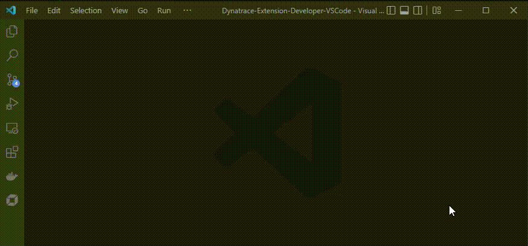
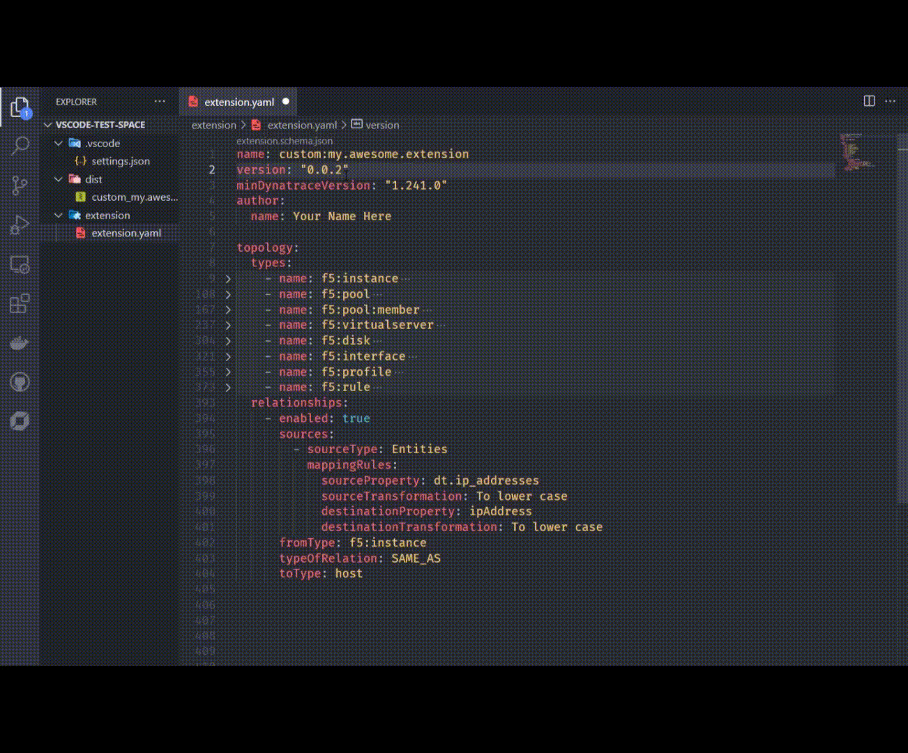
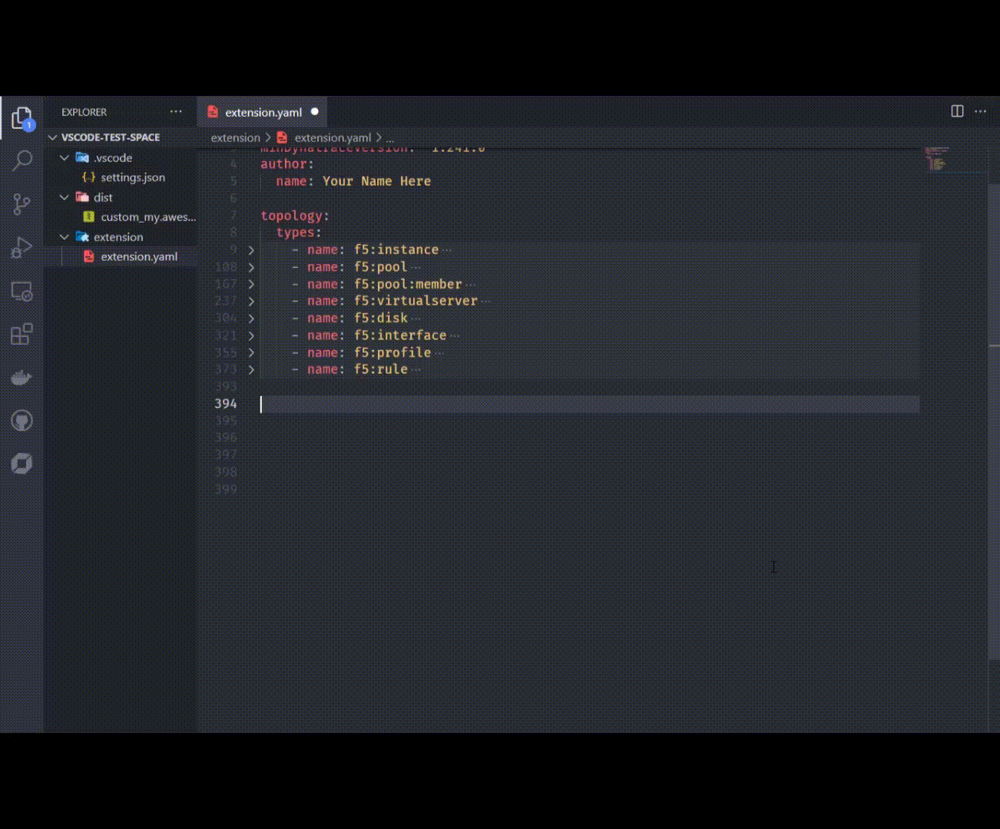
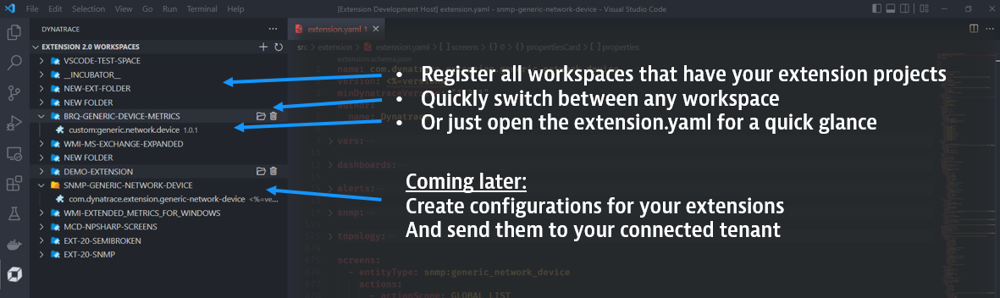
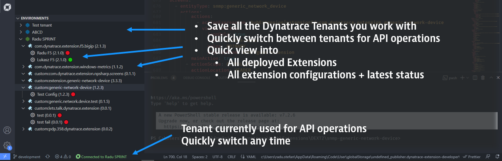

# Dynatrace Extension Developer

This is a VisualStudio Code Extension that aims to provide support for all aspects of developing Dynatrace Extensions 2.0. It provides a specialised toolkit to facilitate extension & environment management, lifecycle operation automation, content validation and automation, and more.

- [Dynatrace Extension Developer](#dynatrace-extension-developer)
  - [Dependencies](#dependencies)
  - [Settings](#settings)
  - [Workflows (Commands)](#workflows-commands)
    - [🚀 Initialize workspace](#-initialize-workspace)
    - [📄 Load schemas](#-load-schemas)
    - [🔐 Generate certificates](#-generate-certificates)
    - [🔗 Upload certificate](#-upload-certificate)
    - [🎁 Build extension](#-build-extension)
    - [📤 Upload extension to tenant](#-upload-extension-to-tenant)
    - [🔂 Activate extension on tenant](#-activate-extension-on-tenant)
    - [📑 Create documentation](#-create-documentation)
  - [Assisted extension development](#assisted-extension-development)
    - [Code completions](#code-completions)
    - [Code actions](#code-actions)
    - [Code lens](#code-lens)
  - [Custom Dynatrace View](#custom-dynatrace-view)
    - [Extension 2.0 Workspaces](#extension-20-workspaces)
    - [Dynatrace Environments](#dynatrace-environments)
- [Start using it!](#start-using-it)

## Dependencies

This current implementation of the project depends on the Dynatrace [`dt-cli`](https://github.com/dynatrace-oss/dt-cli) utility.
This is not the intention going forward, but cryptography is hard :)

## Settings

This extension can leverage the following VSCode settings (global or workspace level):

- `dynatrace.certificate.location.developerKey` - File path. Bring your own developer key instead of generating a new one.
- `dynatrace.certificate.location.developerCertificate` - File path. Bring your own developer certificate instead of generating a new one.
- `dynatrace.certificate.location.rootOrCaCertificate` - File path. Bring your own root (CA) certificate instead of generating a new one.
- `dynatrace.certificate.commonName` - Specifies the common name (CN) attribute of the certificate. Defaults to "Extension Developer"
- `dynatrace.certificate.organization` - Specifies the organization (O) attribute of the certificate.
- `dynatrace.certificate.organizationUnit` - Specifies the organization unit (OU) attribute of the certificate.
- `dynatrace.certificate.stateOrProvince` - Specifies the state or province (ST) attribute of the certificate.
- `dynatrace.certificate.countryCode` - Specifies the country code (C) attribute of the certificate.

## Workflows (Commands)

This extension implements the following commands.
Most of them, unless specified otherwise should be run from within a VSCode workspace.
Commands are invoked from the command palette (`Ctrl + Shift + P`). All commands are prefixed with `Dynatrace`.

 

### 🚀 Initialize workspace

Initializes a new workspace for Dynatrace Extension (2.0) Development.
This includes loading up schemas, creating extension folder and stub, and creating an empty dist folder.
This will also configure the `yaml.schema` extension to validate `extension.yaml` with your chosen schema version.
Once finished, the workspace appears in the new Dynatrace view.

### 📄 Load schemas

Downloads schema files of a specific version and updates the `yaml.schema` extension to validate `extension.yaml` with this version.

### 🔐 Generate certificates

Generates all the required keys and certificates needed for signing and validating Extensions 2.0.
At the end, you can upload your newly generated root certificate to the Dynatrace Credentials Vault.

### 🔗 Upload certificate

Uploads the workspace's root certificate to the Dynatrace Credential Vault.

### 🎁 Build extension

Calls onto `dt-cli` to build your extension. The archive is placed inside the `dist` folder of the workspace.
Building extensions is not supported for non-custom extensions (i.e. name must start with `custom:`).

### 📤 Upload extension to tenant

Uploads the most recent package from your workspace's `dist` folder to the Dynatrace tenant associated with the workspace.
After upload, you are also prompted to activate this latest version. In the case that you reached the maximum allowed 
number of extension versions, you will be prompted to delete the oldest one.

### 🔂 Activate extension on tenant

Activate a version of your workspace's extension on the tenant associated with the workspace. The tenant is polled for all
available versions of the extension and you are prompted to choose which to activate.

### 📑 Create documentation

Reads through the `extension.yaml` file and creates a README.md next to the `extension` folder, documenting (as best as possible) the extension package.

## Assisted extension development

### Code completions

The extension will trigger suggestions for code completion where possible.

Currently implemented completions trigger:

- on `fromType` and `toType` attributes of any `topology.relationships` item
- on `sourceAttribute` and `destinationAttribute` attributes of any relationship based on entity mapping rules (provided you have already filled in `fromType` and `toType` respectively)
- on `entityType` and `entityTypes` anywhere in the yaml, relevant entity types are suggested
- on lists of attribute type properties, on `key` the keys of relevant entity attributes are suggested
- on `entitySelectorTemplate` can make use of Ctrl+Space to trigger completions as the selector is being built

### Code actions

The extension will highlight actions to add snippets of code where possible.
On specific keywords, the _lightbulb_ icon will show to list things that can be automatically added to the code.

Currently implemented action triggers:

- inside `propertiesCard` when clicking on `properties` - you can automatically add entry for the relevant entity attribute properties
- inside `chartsCards` and `entitiesListCards` when clicking on `charts` inside a card - you can automatically add charts for metrics that aren't already in the card
- inside `screens` when clicking on `chartsCards` - you can automatically add chart cards for entire feature sets of metrics
- inside `screens` when clicking on `entitiesListCards` - you can automatically add cards for listing this entity as well as the related ones

### Code lens

Code Lens are actionable, contextual information, interspersed with your code. For Dynatrace Extensions, these can help trigger some code-related action to your tenant.

**Metric Selector Code Lenses**

- See the last validation status of any metric selector
- Validate any metric selector against a connected Dynatrace tenant
- Run any metric selector and visualize the query results

## Custom Dynatrace View

### Extension 2.0 Workspaces

Once you initialize a workspace, this becomes available from the new "Dynatrace" menu that was added to the activity bar.

The Extensions 2.0 Workspaces view offers a high level overview of all registered workspaces and the extensions within them.
Buttons within this view enable quick actions for:

- Adding and initializing a new workspace (plus button at the top)
- Quickly opening one of the extension.yaml files (file button next to the extension name)
- Opening one of the registered workspaces (folder button next to the workspace name)

### Dynatrace Environments

Use the Dynatrace Environments view to register all the Dynatrace (SaaS/Managed) environments that you work with.
This enables you to save connection details and quickly select which environment you're working with (for API-based operations).

Once environments are added, you get a view into all extensions available in that environment.

At a glance:

- See what extensions are deployed and what version is active
- See what monitoring configurations are configured and what is the latest state
- Quickly select which environment's details you want to use for API-based operations

You can edit or remove environment details from the same list.

# Start using it!

Currently, this project is in alpha stage - this means there is heavy development still happening, things may break, or change completely between versions.
Bugs are expected, however, during this stage please provide any feedback to radu.stefan@dynatrace.com regarding:
* full feature ideas
* workflow ideas
* ease of use of current features
* usefulness (or lack of) for current features

Right now, the extension is not published to the marketplace so you'll have to install it from the `.vsix` file packaged in every [release](https://github.com/dynatrace-extensions/dynatrace-extension-developer/releases).
In VSCode, open the Extensions menu, click the "..." and choose "Install from VSIX..".